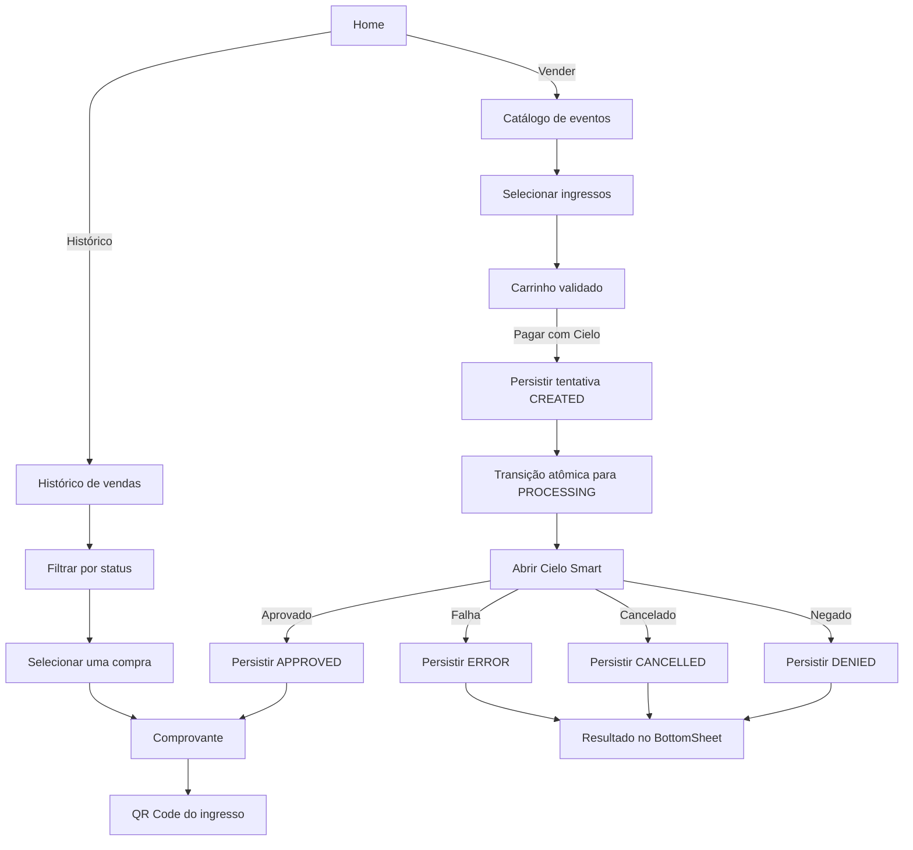
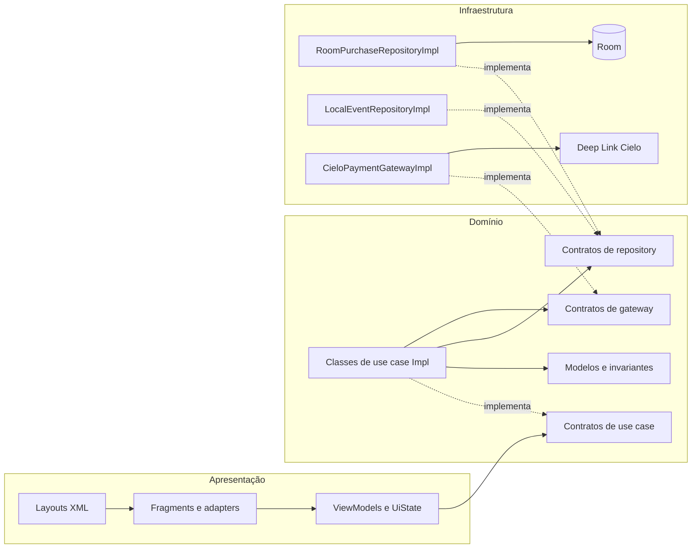
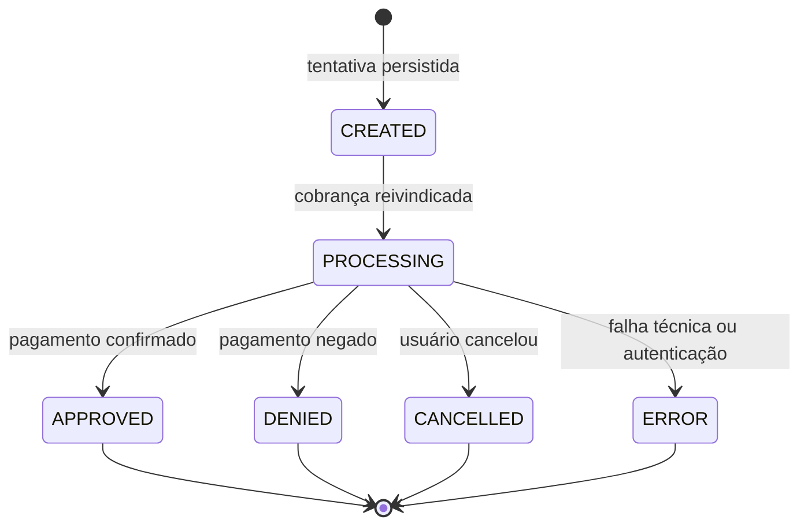
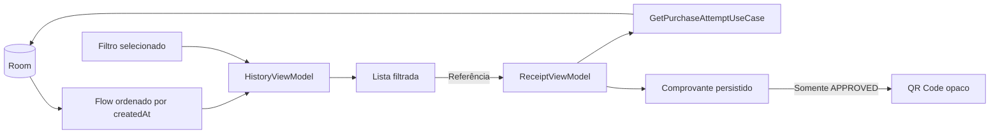

# Diagramas e fluxos

Os diagramas abaixo usam Mermaid e são renderizados diretamente pelo GitHub.
Eles permitem acompanhar visualmente a navegação, as dependências e os pontos
críticos da integração.

## Jornada principal



## Arquitetura e dependências



As setas contínuas representam dependências de execução. As setas tracejadas
indicam implementações concretas de contratos.

## Sequência do pagamento

```mermaid
sequenceDiagram
    actor Operador
    participant View as BottomSheet XML
    participant Checkout as CheckoutViewModel
    participant Create as CreatePurchaseAttemptUseCase
    participant Save as SavePurchaseAttemptUseCase
    participant Start as StartPaymentUseCase
    participant DB as Room
    participant Cielo as Cielo Smart
    participant Callback as CieloResponseActivity

    Operador->>View: Toca em Pagar com Cielo
    View->>Checkout: start(cart)
    Checkout->>Create: criar snapshot e UUID
    Create-->>Checkout: PurchaseAttempt CREATED
    Checkout->>Save: persistir tentativa e itens
    Save->>DB: transação
    DB-->>Save: salvo
    Save-->>Checkout: Saved
    Checkout->>Start: iniciar tentativa persistida
    Start->>DB: compare-and-set CREATED → PROCESSING

    alt transição adquirida
        DB-->>Start: Updated
        Start->>Cielo: abrir lio://payment
        Cielo-->>Callback: order://payment?response=Base64
        Callback-->>Checkout: broadcast restrito ao pacote
        Checkout->>DB: PROCESSING → status terminal

        alt pagamento aprovado
            Checkout-->>View: navegar para comprovante
        else negado, cancelado ou erro
            Checkout-->>View: exibir resultado terminal
        end
    else tentativa já processando
        DB-->>Start: StatusMismatch
        Start-->>Checkout: AlreadyProcessing
    end
```

## Máquina de estados



Estados terminais não aceitam novas transições. Repetições do mesmo callback são
tratadas como idempotentes.

## Histórico e comprovante



O filtro modifica apenas o estado de apresentação. O comprovante sempre é
recarregado do banco pela referência, evitando dados de navegação desatualizados.
